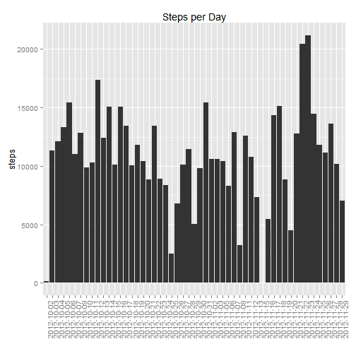

Reproducible Research: Peer Assessment 1
========================================================================


### Loading and preprocessing the data

Unzip and read in data


```r
setwd("~/R/Reproducible Research/RepData_PeerAssessment1")
unzip("activity.zip")
activity <- read.csv("activity.csv")
```

Delete rows with missing values


```r
completedMeasurements<- activity[complete.cases(activity),]
```

### What is mean total number of steps taken per day?

Calculate total steps for each day


```r
sum <-aggregate(completedMeasurements$steps, list(date=completedMeasurements$date), sum)
```

Plot as histogram


```r
library(ggplot2)
q <- qplot(sum$date, sum$x, geom="bar", stat="identity", xlab = "", ylab = "steps", main = "Steps per Day")
q + theme(axis.text.x = element_text(angle = 90, hjust = 1))
```

 
 
Calculate mean and median of steps taken per day


```r
mean(sum$x)
```

```
## [1] 10766
```

```r
median(sum$x)
```

```
## [1] 10765
```

### What is the average daily activity pattern?

**Time series plot of 5-minute interval vs average number of steps take**   

Calculate the average steps for each time interval


```r
meanSteps <- numeric()
for(i in seq(0,2355,5)){
    specificInterval <- activity[activity$interval == i,]
    meanSteps <- c(meanSteps, mean(specificInterval$steps, na.rm = TRUE))
}
```
 
Delete NAs


```r
meanSteps <- meanSteps[complete.cases(meanSteps)]
```
 
Create a dataframe of intervals and step averages


```r
intervalAverage <- cbind(activity[1:288,3], meanSteps)
colnames(intervalAverage) <- c("interval", "meanSteps")
intervalAverage<- data.frame(intervalAverage)
```
 
Plot 5-minute interval vs average steps


```r
plot(intervalAverage$interval, intervalAverage$meanSteps, type = "l", xlab = "5-Minute Interval", ylab = "Average Steps")
```

 
 
Which 5-minute interval contains the maximum number of steps?

```r
intervalAverage[intervalAverage$meanSteps == max(intervalAverage$meanSteps),]
```

```
##     interval meanSteps
## 104      835     206.2
```

### Inputing missing values

**Calculate and report the total number of missing values in the dataset**


```r
sum(is.na(activity$steps)) 
```

```
## [1] 2304
```
 
**Create a new dataset that is equal to the original dataset but with the missing data filled in.**

Make a copy of your activity dataframe


```r
activityNoNA = activity
```

Replace all NA step values with the average value for the respective interval


```r
for (i in 1:length(activityNoNA$steps)){          
    row <- activityNoNA[i,]                       
    if (is.na(row$steps)){                   
        activityNoNA[i,1] = intervalAverage$meanSteps[intervalAverage$interval == row$interval]
    }
}
```

Histogram of the total number of steps taken each day.


```r
totalStepsPerDay <- aggregate(activityNoNA$steps, list(date=activityNoNA$date), sum)

library(ggplot2)
q <- qplot(totalStepsPerDay$date, totalStepsPerDay$x, geom="bar", stat="identity", xlab = "", ylab = "steps", main = "Steps per Day")
q + theme(axis.text.x = element_text(angle = 90, hjust = 1))
```

 
 
**Mean and median total number of steps taken per day**


```r
mean(totalStepsPerDay$x)
```

```
## [1] 10766
```

```r
median(totalStepsPerDay$x)
```

```
## [1] 10766
```

### Are there differences in activity patterns between weekdays and weekends?

Coerce date column to a POSIX object and add a column for the weekday to the dataframe


```r
activityNoNA$date <- strptime(activityNoNA$date, format="%Y-%m-%d")
activityNoNA$partOfWeek <- weekdays(activityNoNA$date)
```
 
Replace all "Saturday" and "Sunday" with "weekend" and all other days with "weekday" and coerce to factors.


```r
for (i in 1:length(activityNoNA$steps)){
    if ((activityNoNA[i,4] == "Saturday") | (activityNoNA[i,4] == "Sunday")){
        activityNoNA[i,4] <- "weekend"
    }
    else{
        activityNoNA[i,4] <- "weekday"
    }
}

activityNoNA$partOfWeek <- as.factor(activityNoNA$partOfWeek)
```


**Panel plot containing a time series plot of the 5-minute interval and the average number of steps taken, averaged across all weekday days or weekend days.**
    
Split dataframe into two subsets for weekdays and weekends


```r
weekdays <- subset(activityNoNA, activityNoNA$partOfWeek == "weekday")
weekend <- subset(activityNoNA, activityNoNA$partOfWeek == "weekend")
```
 
1. Weekdays


```r
meanStepsWeekday <- numeric()
for(i in seq(0,2355,5)){
    specificInterval <- weekdays[weekdays$interval == i,]
    meanStepsWeekday <- c(meanStepsWeekday, mean(specificInterval$steps))
}

meanStepsWeekday <- meanStepsWeekday[complete.cases(meanStepsWeekday)] 
intervalAverageWeekday <- cbind(weekdays[1:288,3], meanStepsWeekday)
intervalAverageWeekday<- data.frame(intervalAverageWeekday)
```
 
2. Weekends


```r
meanStepsWeekend <- numeric()
for(i in seq(0,2355,5)){
    specificInterval <- weekend[weekend$interval == i,]
    meanStepsWeekend <- c(meanStepsWeekend, mean(specificInterval$steps))
}

meanStepsWeekend <- meanStepsWeekend[complete.cases(meanStepsWeekend)]
intervalAverageWeekend <- cbind(weekend[1:288,3], meanStepsWeekend)
intervalAverageWeekend<- data.frame(intervalAverageWeekend)
```
 
3. Add column indicating the part of the week, get equal column names, and rbind all data into one dataframe


```r
intervalAverageWeekend$partOfWeek <- "weekend"
intervalAverageWeekday$partOfWeek <- "weekday"
names(intervalAverageWeekend) <- c("interval", "meanSteps", "partOfWeek")
names(intervalAverageWeekday) <- c("interval", "meanSteps", "partOfWeek")
allData <- rbind(intervalAverageWeekend, intervalAverageWeekday)
```

4. Create a multipanel plot


```r
library(lattice)
xyplot(allData$meanSteps ~ allData$interval | allData$partOfWeek, layout = c(1,2), type = "l", xlab = "interval", ylab = "meanSteps")
```

 
